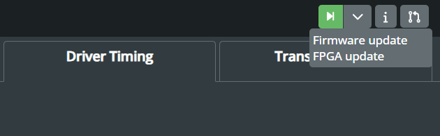
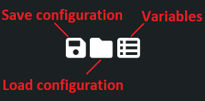

# SmartWave Quick Guide

## Overview
In this article, we'll guide you through setting up [SmartWave](https://www.semify-eda.com/smartwave) for a typical application. 
We'll highlight some of its key features, demonstrate how to configure it using our WebGUI, and provide a simple demonstrator illustrating the process using the SPI interface.

## About SmartWave
SmartWave offers a ready-to-use solution for seamless communication with a variety of devices, including ADCs, DACs, sensors, and more, through standard interfaces like SPI or I2C, along with flexible GPIOs.  
Serving as an SPI/I2C Host Adapter, it simplifies connectivity while enhancing the accuracy and efficiency of device interactions. Built on an advanced FPGA platform, SmartWave ensures unmatched performance and adaptability. 
With its versatile software, it effortlessly meets diverse testing requirements. For those interested in the technical details of SmartWave, we recommend reviewing the [datasheet](https://www.semify-eda.com/smartwave-datasheet).

  

## Setup
To begin, connect SmartWave to the host PC using a USB Micro B type cable. For uninterrupted data transfer, it's recommended to use a USB 3 connection and connect directly to the PC rather than through a USB hub. 
SmartWave does not require any driver or software installation, everything can be handled through our user-friendly [WebGUI](https://gui.smart-wave-control.com/). First, we have to select the device we wish to connect to.

  

Afterwards, we can check if there are any firmware or FPGA updates available for SmartWave.

  

Following this, we can start configuring SmartWave to interact with the target device. As it was mentioned, we are going to use an SPI interface as an example. 

## SPI Protocol
The purpose of this section is not to provide an exhaustive explanation of the SPI protocol, but rather to offer a general overview and highlight the key features used in this example. 
For a more comprehensive introduction to the SPI interface, refer to the resources provided by [Analog Devices](https://www.analog.com/en/resources/analog-dialogue/articles/introduction-to-spi-interface.html).

SPI is a widely used interface for communication between microcontrollers and peripheral ICs, including sensors, ADCs, DACs, shift registers, or SRAM. 
It operates as a synchronous, full-duplex interface, available in both 3-wire and 4-wire configurations. In 4-wire SPI, four signals are utilised: 
clock (SCLK), chip select (CS), main out/subnode in (MOSI), and main in/subnode out (MISO). The main device can select the clock polarity and phase, 
where polarity is the signal state during the idle period. This idle state occurs when CS transitions from high to low at the transmission start and 
from low to high at the transmission end. Depending on the clock phase, data is sampled and/or shifted using the rising or falling clock edge. 
The SPI interface offers a considerably higher clock frequency, typically in the MHz range, compared to I2C.

To initiate SPI communication, the main device must send the clock signal and enable the chip select (CS) signal to select the subnode. 
Typically, the chip select operates on an active low signal, requiring the main to send a logic 0 to select the subnode. SPI operates as a full-duplex interface, 
allowing both the main and subnode to transmit data simultaneously via the MOSI and MISO lines, respectively. During SPI communication, 
data is shifted out serially onto the MOSI bus while being sampled or read in from the MISO bus. The serial clock edge synchronises the shifting and sampling of the data.

## SmartWave Configuration 
### Select Drivers
Setting up SmartWave for SPI interface is a simple process with our WebGUI. By clicking on the “+” sign under the Drivers section, we can add an SPI driver for our setup. 

  

The SPI driver encompasses all the settings aforementioned, offering users significant flexibility to select the number of bits for transmission and their direction, whether sending the MSB or LSB first. Users can also configure the CS polarity as active-high or active-low, and adjust the clock polarity, phase, and frequency.

  

### Pin Selection
Users can easily select the SPI pins from SmartWave's 16 flexible GPIOs, either through the drop-down menu in the Pins section or by using the Pin layout. In the case of configuring the SPI interface in a 3-wire mode, the MISO line is left unconnected.

  

### Timing Diagrams
One notable feature of the WebGUI is the driver timing diagram, which provides instant feedback to users when adjusting the driver settings. 
This visualisation aids in understanding how the data transfer is configured.
For the SPI Driver, we have the following four modes available:

| *SPI Mode*  | *CPOL* | *CPHA* | *Data Shifted out on*  | *Data Shifted out on*  |
| :---------: | :----: | :----: | :--------------------: | :--------------------: |
|     0       |    0   |   0    |       failing SCLK     |       rising SCLK      |
|     1       |    0   |   1    |       rising SCLK      |       failing SCLK     |
|     2       |    1   |   0    |       rising SCLK      |       failing SCLK     |
|     3       |    1   |   1    |       failing SCLK     |       rising SCLK      |

### Write Data
After configuring the SPI driver and selecting the desired pins, the next step is to define the data for transmission, which is managed within the Data section. Data can be specified as hexadecimal, binary, or decimal numbers. Users also have the ability to save the data into a text file or to load a pre-defined dataset.

However, typing in data manually poses a risk of errors, especially with large datasets. To address this concern, we've introduced the option of utilising user defined variables. These custom variables, stored in a JSON file, can be imported into the WebGUI. Once loaded, users can simply use the variable names in the Write Data section.

 

  

Moreover, users also have the option to request a readback from the subnode, although this requires a 4-wire connection using the MISO line, as well as defining the sample frequency.

 

  

To simplify the process of replicating test cases, users have the convenient option to save their current setup  in a JSON file. This enables them to store the specific configurations, including SPI driver settings, selected pins, and data definitions. Later, users can load these saved configurations when needed, streamlining the test setup process and ensuring consistency across multiple testing scenarios. 

 

  

### Interacting with the Target Device
Once we've verified that SmartWave is correctly configured, we can proceed to connect it to the target device. In this example, we're using SPI in 3-wire mode. Therefore, we have to connect the SCLK, MOSI, and CS lines for communication, alongside VDD and GND to supply power.

 

  

To initiate the SPI interface, users have the option to run it from the WebGUI, either in single or continuous mode. Alternatively, they can utilise the trigger button on the SmartWave. In this example, we transmit eleven 16-bit long data frames to display "HELLO" on a seven-segment display. For those who are interested in replicating this demo, can download the “[SPI_7segment.json](https://github.com/semify-eda/SmartWave_demos/blob/1e7651f6efb90a0283b20c9a54a783fc10c3edab/configuration_files/SPI%207segment.json)” configuration file from our GitHub repository.

  

The WebGUI also offers a Transaction Log, detailing the driver used, whether data was written or read from the target device, and the data itself. This feature provides immediate feedback to users, ensuring the selected protocol operates correctly. For more comprehensive test runs, users have the option to export the transaction log as a CSV file for additional analysis.

  

The image below illustrates the entire configuration in the WebGUI, enabling interaction with the 7-segment display using SmartWave through the SPI interface.

  

## Conclusion
This article has provided a detailed guide to setting up SmartWave for a typical application, focusing on the SPI interface. By following the instructions outlined here, users can easily configure SmartWave using the WebGUI and leverage its advanced features for seamless device interaction. SmartWave's user-friendly interface and versatile software make it an invaluable tool for various testing and development tasks. We encourage users to explore further possibilities with SmartWave and leverage its capabilities to streamline testing processes and enhance development workflows. With SmartWave, users can efficiently configure and interact with devices, accelerating development cycles and facilitating efficient testing.

